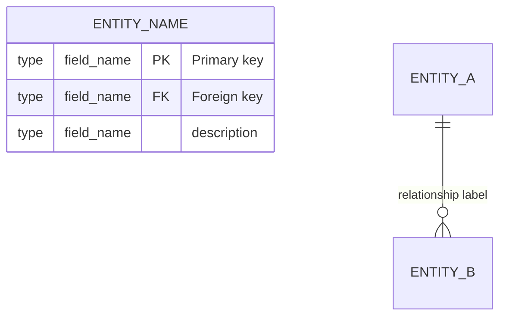
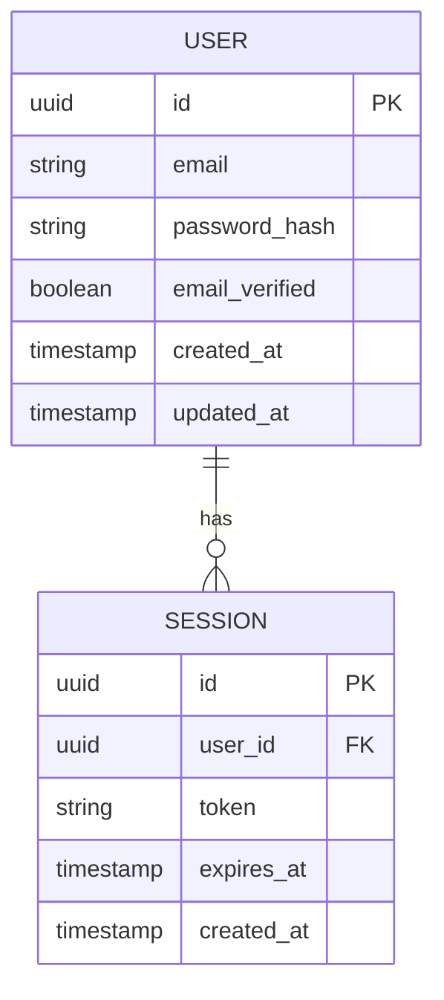
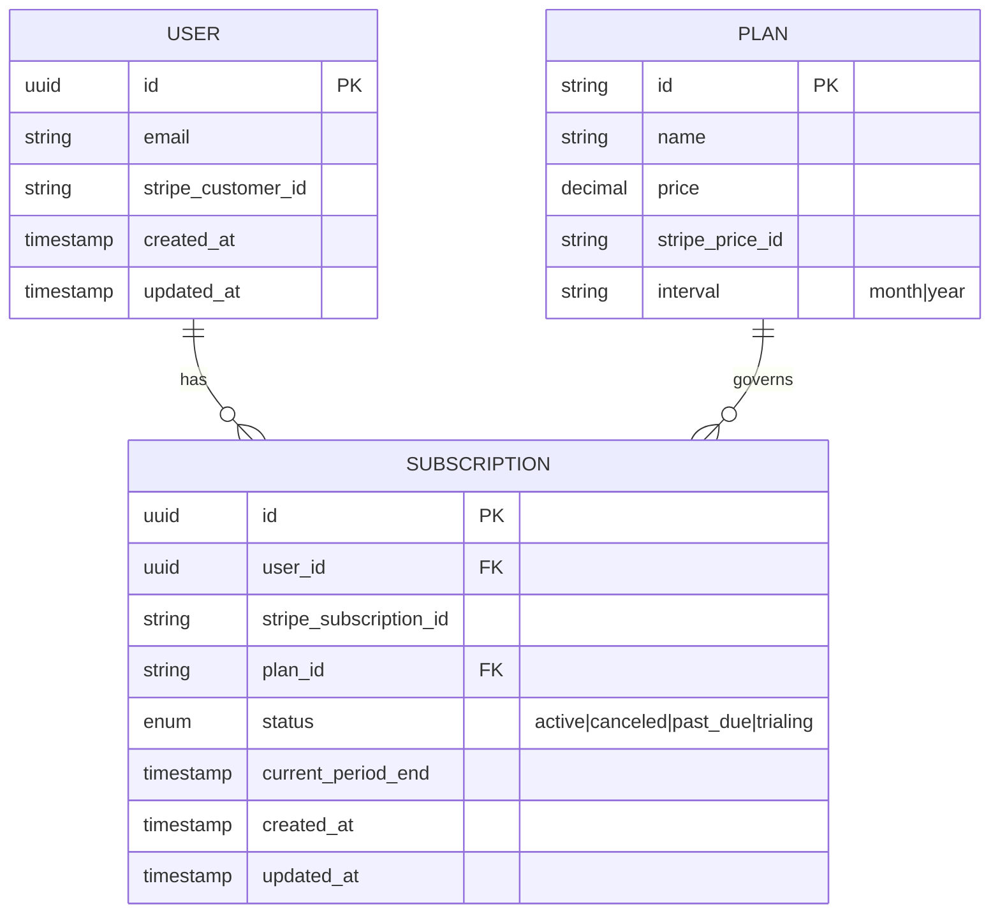
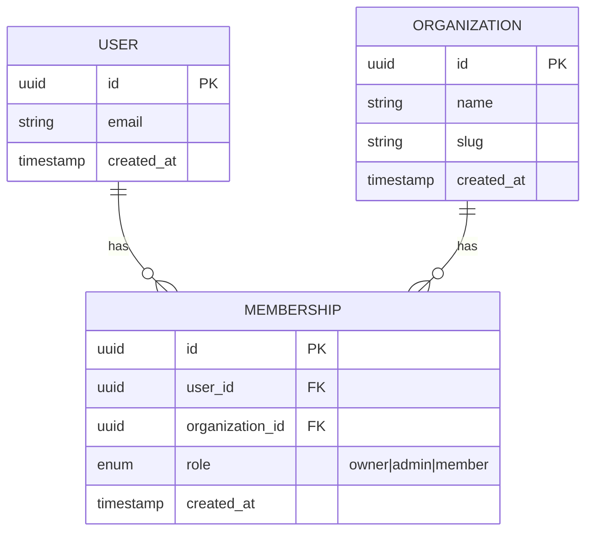

# ERD Guide — Mermaid Format

Reference for inception:design when generating Entity Relationship Diagrams.

---

## Mermaid ERD Syntax



### Relationship Cardinality Symbols

| Symbol | Meaning |
|---|---|
| `||--||` | One to one |
| `||--o{` | One to zero-or-many |
| `||--|{` | One to one-or-many |
| `o{--o{` | Zero-or-many to zero-or-many |
| `}|--|{` | One-or-many to one-or-many |

---

## Field Type Reference

Use these types consistently:

| Type | Use For |
|---|---|
| `uuid` | Primary keys (preferred over integer for distributed systems) |
| `int` | Auto-increment IDs, counts, ordinals |
| `string` | Short text (name, email, slug) |
| `text` | Long text (description, body, notes) |
| `boolean` | Flags (is_active, is_verified, is_deleted) |
| `timestamp` | Dates and times (created_at, updated_at, deleted_at) |
| `decimal` | Money, precise decimals |
| `json` | Flexible/schemaless data (metadata, settings) |
| `enum` | Constrained value sets (status, role, type) |

---

## Standard Fields (include on all entities)

```
id          uuid    PK
created_at  timestamp
updated_at  timestamp
```

For soft-delete patterns, add:
```
deleted_at  timestamp "null if not deleted"
```

---

## Entity Derivation from Features

Use this map to derive entities from `core_features`:

| Feature | Entities to Include |
|---|---|
| Authentication | USER, SESSION (if not using third-party auth) |
| Payments / Billing | SUBSCRIPTION, PLAN, PAYMENT, INVOICE |
| Real-time / Chat | MESSAGE, CHANNEL, CONVERSATION |
| File Upload | FILE, ATTACHMENT |
| Admin Dashboard | AUDIT_LOG, ROLE, PERMISSION |
| Search | (usually no extra entity — fulltext on existing) |
| Email | EMAIL_LOG (optional, for tracking sends) |
| Push Notifications | NOTIFICATION, DEVICE_TOKEN |
| Multi-tenancy | ORGANIZATION, MEMBERSHIP |

Always add entities from `custom_features` — derive fields from the feature description.

---

## Common ERD Patterns

### User + Auth (no third-party auth)


### User + Subscription (Stripe)


### Multi-tenant Organization


---

## ERD Output Format

Always present the ERD in a fenced mermaid code block followed by a legend:

````
```mermaid
erDiagram
  [entities and relationships]
```

**ERD Notes:**
- [Any non-obvious design decisions]
- [Soft-delete strategy if used]
- [Polymorphic relationships explained]
- [Fields omitted for clarity: created_at, updated_at on all entities]
````

---

## ERD Quality Checklist

Before presenting the ERD:

- [ ] All entities from `core_features` are represented
- [ ] All entities from `custom_features` are represented
- [ ] Every entity has `id`, `created_at`, `updated_at`
- [ ] Foreign keys are labeled with FK
- [ ] Relationship labels are human-readable verbs ("has", "belongs to", "contains")
- [ ] Cardinality is correct on all relationships
- [ ] Enum fields list their allowed values in the description
- [ ] No orphaned entities (every entity participates in at least one relationship)
- [ ] Complex relationships are explained in the ERD Notes section
